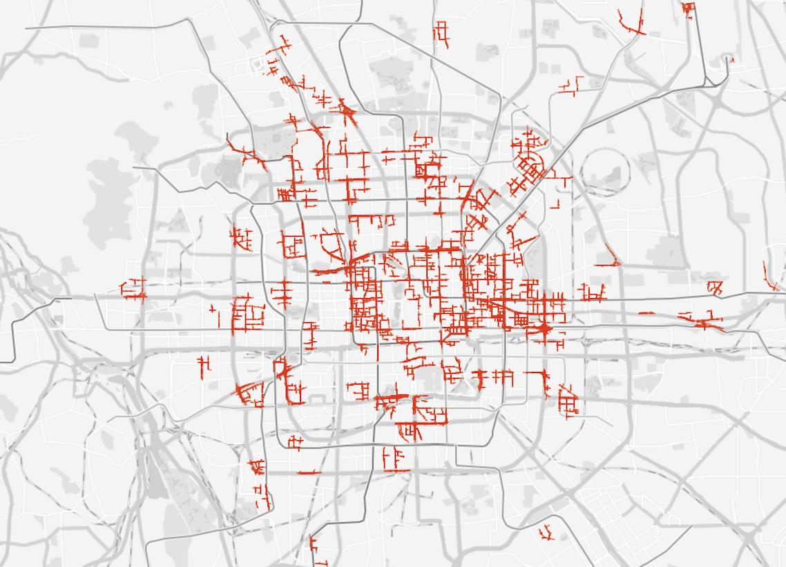
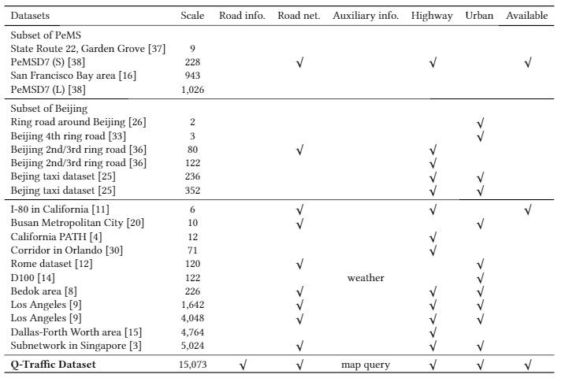

# Deep Sequence Learning with Auxiliary Information for Traffic Prediction. KDD 2018. (Accepted)

### Binbing Liao, Jingqing Zhang, Chao Wu, Douglas McIlwraith, Tong Chen, Shengwen Yang, Yike Guo, Fei Wu

###### Binbing Liao and Jingqing Zhang contributed equally to this article. 

[Paper Link](#) (Pending)

## Contents

1. [Abstract](#Abstract)
2. [Model](#Model)
3. [Q-Traffic Dataset](#Dataset)
4. [Experiments](#Experiments)
5. [Code](#Code)
6. [Citation](#Citation)
7. [Poster and Video](#Poster)

<h2 id="Abstract">Abstract</h2>
Predicting traffic conditions from online route queries is a challenging task as there are many complicated interactions over the roads and crowds involved. In this paper, we intend to improve traffic prediction by appropriate integration of three kinds of implicit but essential factors encoded in auxiliary information. We do this within an encoder-decoder sequence learning framework that integrates the following data: 1) offline geographical and social attributes. For example, the geographical structure of roads or public social events such as national celebrations; 2) road intersection information, i.e. in general, traffic congestion occurs at major junctions; 3) online crowd queries. For example, when many online queries issued for the same destination due to a public performance, the traffic around the destination will potentially become heavier at this location after a while. Qualitative and quantitative experiments on a real-world dataset from Baidu have demonstrated the effectiveness of our framework.

<h2 id="Model">Model</h2>
model

<h2 id="Dataset">Q-Traffic Dataset</h2>
We collected a large-scale traffic prediction dataset - Q-Traffic dataset, which consists of three sub-datasets: query sub-dataset, traffic speed sub-dataset and road network sub-dataset. We compare our released Q-Traffic dataset with different datasets used for traffic prediction.

### Query Sub-dataset
This sub-dataset was collected in Beijing, China between April 1, 2017 and May 31, 2017, from the [Baidu Map](https://map.baidu.com). The detailed pre-processing of this sub-dataset is decribed in the paper. The query sub-dataset contains about 114 million user queries, each of which records the <code>starting time-stamp, coordinates of the starting location (mercator), estimated travel time (minutes), coordinates of the destination (mercator)</code>, and <code>query word</code>. There are some query samples as follows:

<code>
2017-04-01 19:42:23, 12949432.0	4843443.0, 33, 12952254.0 4851399.0, 北京市昌平区文华路  

2017-04-01 18:00:05, 12967555.0	4825800.0, 20, 12961432.93 4831432.89, 北官厅胡同  

2017-04-01 01:14:08, 12949418.0	4837530.0, 18, 12953985.0 4836373.55, 京味斋(花园北路店)  

</code>

### Traffic Speed Sub-dataset
We also collected the traffic speed data for the same area and during the same time period as the query sub-dataset. This sub-dataset contains 15,073 road segments covering approximately 738.91 km. Figure 1 shows the spatial distribution of these road segments, respectively.  

  
   <i>Figure 1. Spatial distribution of the road segments in Beijing</i>

They are all in the 6th ring road (bounded by the lon/lat box of <116.10, 39.69, 116.71, 40.18>), which is the most crowded area of Beijing. The traffic speed of each road segment is recorded per minute. To make the traffic speed predictable, for each road segment, we use simple [moving average](https://en.wikipedia.org/wiki/Moving_average) with a 15-minute time window to smooth the traffic speed sub-dataset and sample the traffic speed per 15 minutes. 
Thus, there are totally 5856 ($61 \times 24 \times 4$) time steps, and each record is represented as <code>road_segment_id, time_stamp ([0, 5856))</code> and <code>traffic_speed (km/h)</code>.

There are some traffic speed samples as follows:

<code>
15257588940, 0, 42.1175  

...

15257588940, 5855, 33.6599  

1525758913, 0, 41.2719  

...  

</code>

### Road Network Sub-dataset
Due to the spatio-temporal dependencies of traffic data, the topology of the road network would help to predict traffic. Table 1 shows the fields of the road network sub-dataset. 

  
   <i>Table 1. Examples of geographical attributes of each road segment.</i>

For each road segment in the traffic speed sub-dataset, the road network sub-dataset provides the starting node (*snode*) and ending node (*enode*) of the road segment, based on which the topology of the road network can be built. In addition, the sub-dataset also provides various geographical attributes of each road segment, such as width, length, speed limit and the number of lanes. Furthermore, we also provide the social attributes such as weekdays, weekends, public holidays, peak hours and off-peak hours.

### Comparison with Other Datasets
Table 2 shows the comparison of different datasets for traffic speed prediction. In the past few years, researchers have performed experiments with small or (and) private datasets. The release of Q-Traffic, a large-scale public available dataset with offline (geographical and social attributes, road network) and online (crowd map queries) information, should lead to an improvement of the research of traffic prediction.

  
   <i>Table 2. Comparison of different datasets for traffic speed prediction.</i>

### Access to the Q-Traffic Dataset
Please read and sign the [agreement](fig/AccessQTrafficDataset.pdf) for the access to the Q-Traffic Dataset. After Sending an email to Binbing Liao <code>bbliao@zju.edu.cn</code>  with signed and scanned agreement of all people (including the supervisor) who want to use the dataset, you will receive an address to download the dataset. 

<h2 id="Experiments">Experiments</h2>
experiments

<h2 id="Code">Code</h2>

The source code has been tested with:
- Python 3.5
- TensorFlow 1.3.0
- TensorLayer 1.7.3
- numpy 1.14.0
- pandas 0.21.0
- scikit-learn 0.19.1

The structure of code:
- [model.py](src/model.py): Implementation of deep learning models
- [train.py](src/train.py): Implementation of controllers for training and testing
- [baselines.py](src/baselines.py): Implementation of baseline models including RF and SVR
- [dataloader.py](src/dataloader.py): Data processing and loading
- others: utilities, playground, logging, data preprocessing

<h2 id="Citation">Citation</h2>

In case using our dataset, please cite the following publication:  

    @inproceedings{bbliaojqZhangKDD18deep,  
      title = {Deep Sequence Learning with Auxiliary Information for Traffic Prediction},  
      author = {Binbing Liao and Jingqing Zhang and Chao Wu and Douglas McIlwraith and Tong Chen and Shengwen Yang  and Yike Guo and Fei Wu},  
      booktitle = {Proceedings of the 24th ACM SIGKDD International Conference on Knowledge Discovery and Data Mining},  
      year = {2018},  
      organization = {ACM}  
    }  

<h2 id="Poster">Poster and Video</h2>

* You can find our KDD 2018 poster here. (Pending)  
* You can find our KDD 2018 Video here. (Pending)  
